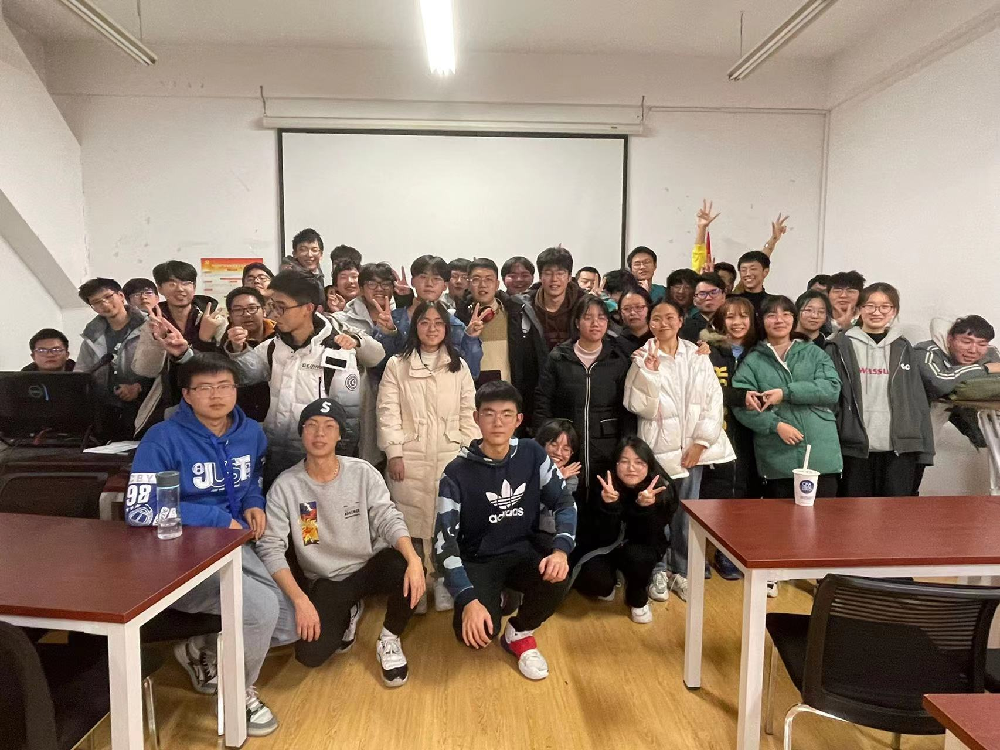
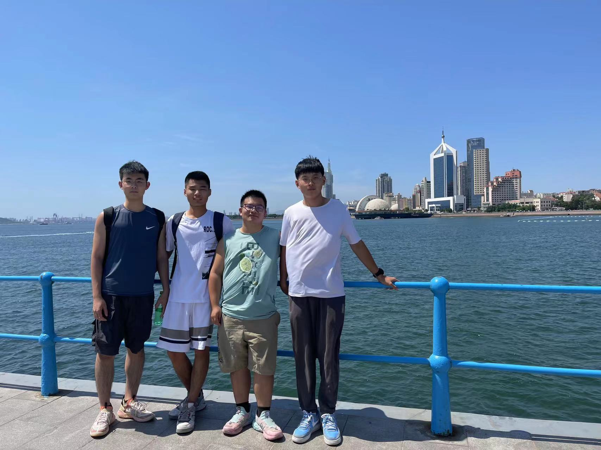

  

    
  

  <picture>
    <source media="(prefers-color-scheme: dark)" srcset="https://github.com/humshan/humshan/blob/main/image/scvs/github-contribution-grid-snake-dark.svg" />
    <source media="(prefers-color-scheme: light)" srcset="https://cdn.jsdelivr.net/gh/sun0225SUN/sun0225SUN/profile-snake-contrib/github-contribution-grid-snake.svg" />
    
  </picture>
 

### **中国海洋大学--就读本科生**

 

### **个人介绍**

不善言谈但待人真诚，学习成绩良好，在班内\
担任班长一职，对待事务认真负责，希望与大家\
多多交流！

### **技术栈:**

  
### **班级合照**

 
  
  
  
  
  
  
  

Github 活跃

**未来畅想**
---------

 
在以后的学习生涯中，希望能更多 的学习到开发方面的经验，为以后 工作提前打好坚实基础！
